<!--
 * @Author: LetMeFly
 * @Date: 2022-04-10 09:40:57
 * @LastEditors: LetMeFly
 * @LastEditTime: 2022-04-15 22:00:41
-->
# FP-growth

FP-growth算法实现关联规则的数据挖掘

+ 在线文档 [https://fp-growth.letmefly.xyz](https://fp-growth.letmefly.xyz)

+ 项目地址 [https://github.com/LetMeFly666/FP-growth](https://github.com/LetMeFly666/FP-growth)

+ See [Apriori(https://github.com/LetMeFly666/Apriori)](https://github.com/LetMeFly666/Apriori) For More

本次决定先实现代码再进行优化，否则直接开始想具体哪种最优的话太慢了。

## 使用方法

```bash
FP-growth[.exe] [-i DATANAME] [-s SUPPORT] [-o RESULT] [-h] [-p]
```

其中```[]```中的内容表示可选。

### 参数列表

|参数| 是否必选 | 类型 | 描述 |
| :--: |:--: |:--: |:--: |
| ```-i``` | ✖ | 输入文件名 | 如果参数中有```-i```，那么程序将会以此参数的下一个参数作为输入文件。如```FP-growth -i source/retail.dat``` |
| ```-s``` | ✖ | 最小支持度 | 如果参数中有```-s```，那么程序将会以此参数的下一个参数作为[最小支持度(百分比)](#minSupport)。如```FP-growth -s 1.25%``` |
| ```-o``` | ✖ | 重定向输出 | 如果参数中有```-o```，那么程序将会重定向输出到下一个参数所代表的文件中。如```FP-growth -o output.txt```。相当于```FP-growth > output.txt```。提示性信息如"请输入数据文件名"不会重定向到该指定文件中。 |
| ```-h``` | ✖ | 显示帮助 | 如果参数中有```-h```，那么程序将会打开在线帮助文档[https://fp-growth.letmefly.xyz](https://fp-growth.letmefly.xyz)。 |
| ```-p``` | ✖ | 执行完暂停 | 如果参数中有```-p```，那么程序执行完将不会退出控制台，而是等待一个任意的按键。 |
| ```-d``` | ✖ | Debug | 如果参数中有```-d```，那么程序将会绘制递归计算流程图，（仅对数据量很小如source/min.dat等数据范围在[0,26]的小数据有效）有效 |

#### 最小支持度 <a id="minSupport"></a>

|方式 | 类型 | 格式 | 描述 |
| :--: |:--: |:--: |:--: |
| 方式一 | 百分比 | 百分数 | 可以输入一个```＞0```的百分数来表示 **最小支持度为交易条数的百分之几** 。 例如```FP-growth -s 1.25%``` 。百分数中允许```小数```的出现。|
| 方式二 | 正整数 | 正整数 | 可以输入一个正整数来表示 **最小支持度是几** 。例如```FP-growth -s 100```。 正整数中不允许小数的出现 |

### 错误类型

程序运行过程中可能会产生一些错误，其中一些将会被捕获的错误列表如下：

| 程序返回值 | 错误类型 | 描述 |
| :--: | :--: | :--: |
| ```0``` | 程序无误 | 正确运行 |
| ```1``` | 参数不足 | 如```-i```后需要参数```DATANAME```，但若```-i```后没有此参数将会返回此错误 |
| ```2``` | 无法打开文件 | 无法读入输入文件，请检查输入文件是否存在 |
| ```3``` | 不合法支持度 | 支持度输入不合法：整数支持度但出现非数字字符 |
| ```4``` | 不合法支持度 | 支持度输入不合法：输入了空的支持度 |
| ```5``` | 不合法支持度 | 支持度输入不合法：%位置没有出现在支持度最后 |
| ```6``` | 不合法支持度 | 支持度输入不合法：.位置不合法或出现了不只一个. |
| ```7``` | 不合法支持度 | 支持度输入不合法：百分比方法且出现其他不合法字符 |

### Example

+ ```fp-growth -i source/min2.dat -s 3 -d```

   运行结果(详见[source/result/visualize_min2_s3.svg](source/result/visualize_min2_s3.svg))：

   

## Release

<details>
<summary>MSVC所需DLL</summary>
<li><a href="https://github.com/LetMeFly666/FP-growth/releases/download/DLLs%2CstaticFilesAndSoOn/Dlls.Because.of.Visual.Sutdio.rar">Dlls.Because.of.Visual.Sutdio.rar</a></li>
<li><a href="https://github.com/LetMeFly666/FP-growth/releases/download/DLLs%2CstaticFilesAndSoOn/msvcp140.dll">msvcp140.dll</a></li>
<li><a href="https://github.com/LetMeFly666/FP-growth/releases/download/DLLs%2CstaticFilesAndSoOn/msvcp140d.dll">msvcp140d.dll</a></li>
<li><a href="https://github.com/LetMeFly666/FP-growth/releases/download/DLLs%2CstaticFilesAndSoOn/ucrtbased.dll">ucrtbased.dll</a></li>
<li><a href="https://github.com/LetMeFly666/FP-growth/releases/download/DLLs%2CstaticFilesAndSoOn/vcruntime140.dll">vcruntime140.dll</a></li>
<li><a href="https://github.com/LetMeFly666/FP-growth/releases/download/DLLs%2CstaticFilesAndSoOn/vcruntime140d.dll">vcruntime140d.dll</a></li>
<li><a href="https://github.com/LetMeFly666/FP-growth/releases/download/DLLs%2CstaticFilesAndSoOn/vcruntime140_1.dll">vcruntime140_1.dll</a></li>
<li><a href="https://github.com/LetMeFly666/FP-growth/releases/download/DLLs%2CstaticFilesAndSoOn/vcruntime140_1d.dll">vcruntime140_1d.dll</a></li>
</details>

<details>
<summary>v1.0.1</summary>
<li><a href="https://github.com/LetMeFly666/FP-growth/releases/download/v1.0.1/FP-growth-v1.0.1-x64-Release.exe">FP-growth-v1.0.1-x64-Release.exe</a></li>
<li><a href="https://download.fastgit.org/LetMeFly666/FP-growth/releases/download/v1.0.1/FP-growth-v1.0.1-x64-Release.exe">FP-growth-v1.0.1-x64-Release.exe</a>镜像地址</li>
<li><a href="https://github.com/LetMeFly666/FP-growth/releases/download/v1.0.1/FP-growth-v1.0.1-x64-Release-WithDLLs.zip">FP-growth-v1.0.1-x64-Release-WithDLLs.zip</a></li>
<li><a href="https://github.com/LetMeFly666/FP-growth/releases/download/v1.0.1/FP-growth-v1.0.1-x64-Debug.exe">FP-growth-v1.0.1-x64-Debug.exe</a></li>
<li><a href="https://github.com/LetMeFly666/FP-growth/releases/download/v1.0.1/FP-growth-v1.0.1-x64-Release-WithDLLs.zip">FP-growth-v1.0.1-x64-Release-WithDLLs.zip</a></li>
<li><a href="https://github.com/LetMeFly666/FP-growth/releases/download/v1.0.1/FP-growth-v1.0.1-x86-Release.exe">FP-growth-v1.0.1-x86-Release.exe</a></li>
<li><a href="https://github.com/LetMeFly666/FP-growth/releases/download/v1.0.1/FP-growth-v1.0.1-x86-Release-WithDLLs.zip">FP-growth-v1.0.1-x86-Release-WithDLLs.zip</a></li>
<li><a href="https://github.com/LetMeFly666/FP-growth/releases/download/v1.0.1/FP-growth-v1.0.1-x86-Debug.exe">FP-growth-v1.0.1-x86-Debug.exe</a></li>
<li><a href="https://github.com/LetMeFly666/FP-growth/releases/download/v1.0.1/FP-growth-v1.0.1-x86-Debug-WithDLLs.zip">FP-growth-v1.0.1-x86-Debug-WithDLLs.zip</a></li>

</details>